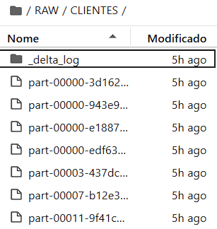
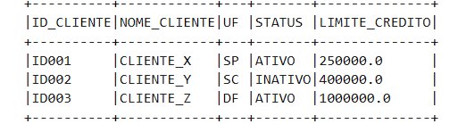
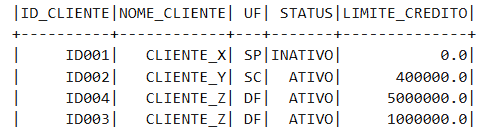
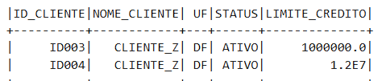
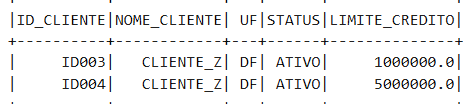

# Delta Lake - Operações em Tabelas

## 1. Introdução

O Delta Lake é uma camada de armazenamento ACID para o Apache Spark.  
Ele permite operações confiáveis de **inserção, atualização, merge e exclusão** em dados, mantendo consistência mesmo em pipelines de Big Data.

Neste documento, vamos explorar as operações na tabela **CLIENTES** usando Delta Lake.

## 2. Inicializando o Spark com Delta Lake

```python
spark = (
    SparkSession
    .builder
    .master("local[*]")
    .config("spark.jars.packages", "io.delta:delta-spark_2.12:3.2.0")
    .config("spark.sql.extensions", "io.delta.sql.DeltaSparkSessionExtension")
    .config("spark.sql.catalog.spark_catalog", "org.apache.spark.sql.delta.catalog.DeltaCatalog")
    .getOrCreate()
)
```

SparkSession.builder: Cria a sessão do Spark, que é a porta de entrada para usar DataFrames, SQL e Delta Lake.

.master("local[*]"): Executa o Spark localmente usando todos os núcleos da máquina.

.config("spark.jars.packages", ...): Baixa automaticamente o pacote Delta Lake para integração.

.config("spark.sql.extensions", ...): Ativa as extensões do Delta Lake no Spark.

.config("spark.sql.catalog.spark_catalog", ...): Configura o catálogo padrão do Spark para suportar tabelas Delta.

.getOrCreate(): Cria a sessão Spark ou retorna uma sessão existente.


## 3. Criando o DataFrame com dados de clientes


```
data = [
    ("ID001", "CLIENTE_X","SP","ATIVO",   250000.00),
    ("ID002", "CLIENTE_Y","SC","INATIVO", 400000.00),
    ("ID003", "CLIENTE_Z","DF","ATIVO",   1000000.00)
]

schema = StructType([
    StructField("ID_CLIENTE",     StringType(), True),
    StructField("NOME_CLIENTE",   StringType(), True),
    StructField("UF",             StringType(), True),
    StructField("STATUS",         StringType(), True),
    StructField("LIMITE_CREDITO", FloatType(), True)
])

df = spark.createDataFrame(data=data, schema=schema)
df.show(truncate=False)
```


data: Lista de tuplas representando os clientes.

schema: Define o tipo de cada coluna (StringType, FloatType) e se permite valores nulos (True).

spark.createDataFrame(...): Cria o DataFrame Spark usando os dados e o schema fornecidos.

df.show(truncate=False): Mostra a tabela completa no console, sem truncar os valores.


## 4. Gravando o DataFrame em Delta Lake

```
(
    df
    .write
    .format("delta")
    .mode('overwrite')
    .save("./RAW/CLIENTES")
)
```

.write: Prepara o DataFrame para ser gravado.

.format("delta"): Especifica que o formato de saída será Delta Lake.

.mode('overwrite'): Substitui qualquer tabela/dados existentes no caminho especificado.

.save("./RAW/CLIENTES"): Salva o Delta Lake localmente na pasta ./RAW/CLIENTES.



-

## 5. Modelo da Tabela 

A tabela **CLIENTES** possui a seguinte estrutura:




-
## 6. Fonte de Dados

- Os dados foram retirados do artigo https://datawaybr.medium.com/como-sair-do-zero-no-delta-lake-em-apenas-uma-aula-d152688a4cc8
- A tabela contém clientes com ID, nome, estado, status e limite de crédito.  
- Todos os registros são fictícios, mas simulam um cenário real de um sistema financeiro ou CRM.

---

## 7. Operações Exemplos

### 7.1 INSERT / MERGE

Essa operação é usada para **inserir novos registros ou atualizar registros existentes**.  
O `merge` do Delta Lake compara a tabela de destino (`CLIENTES`) com a tabela de origem (`newData`) e realiza inserções apenas quando não houver correspondência.

```python
deltaTable.alias("t").merge(
    source=newData.alias("s"),
    condition="t.ID_CLIENTE = s.ID_CLIENTE",
    whenNotMatchedInsertAll()
)
```




Quando usar: Inserir novos clientes sem duplicar registros existentes.

O que acontece: O Delta Lake verifica cada registro do newData. Se não houver correspondência em CLIENTES, insere o novo registro.

Resultado esperado: Novos clientes adicionados e dados existentes preservados.


### 7.2 UPDATE

A operação update é usada para alterar valores de colunas específicas em registros existentes, como atualizar limites de crédito.

```
deltaTable.update(
    condition="ID_CLIENTE = 'ID004'",
    set={"LIMITE_CREDITO": "15000000"}
)
```



Quando usar: Modificar informações de clientes que já existem na tabela.

O que acontece: O Delta Lake localiza o cliente com ID_CLIENTE = 'ID004' e altera apenas a coluna LIMITE_CREDITO.

Resultado esperado: O limite de crédito do cliente é atualizado sem afetar outros campos ou registros.


### 7.3 DELETE

A operação delete é usada para remover registros indesejados da tabela, como clientes inativos ou inválidos.

```
deltaTable.delete("ID_CLIENTE = 'ID003'")
```


Quando usar: Excluir clientes que não devem mais estar na tabela.

O que acontece: O Delta Lake localiza o registro com ID_CLIENTE = 'ID003' e o remove da tabela.

Resultado esperado: O registro deletado não estará mais disponível, mantendo a tabela consistente.


## 8. Conclusão / Observações

O Delta Lake oferece transações ACID sobre dados do Apache Spark, permitindo:

Atualizações e deleções seguras sem corromper os dados.

Inserções incrementais com merge, evitando duplicação.

Manutenção do histórico das alterações, útil em pipelines de dados críticos.

Essas operações simulam cenários reais de sistemas de gestão de clientes, mostrando como o Delta Lake garante consistência, confiabilidade e performance em ambientes de Big Data.