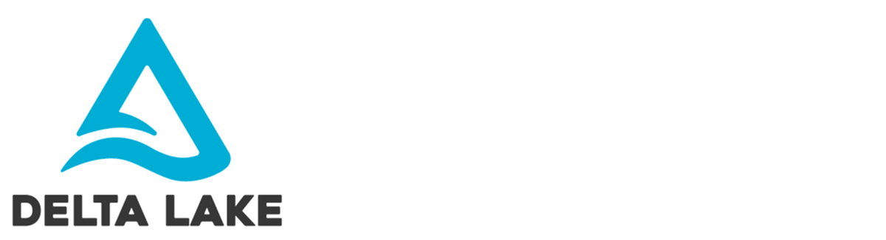

# Bem-vindo ao Projeto Delta Lake e Apache Iceberg

Este site contém a documentação das operações realizadas com Apache Spark, Delta Lake e Apache Iceberg, incluindo exemplos de:

- INSERT
- UPDATE
- DELETE
- MERGE

A documentação foi organizada para facilitar o estudo e a reprodução do ambiente.

