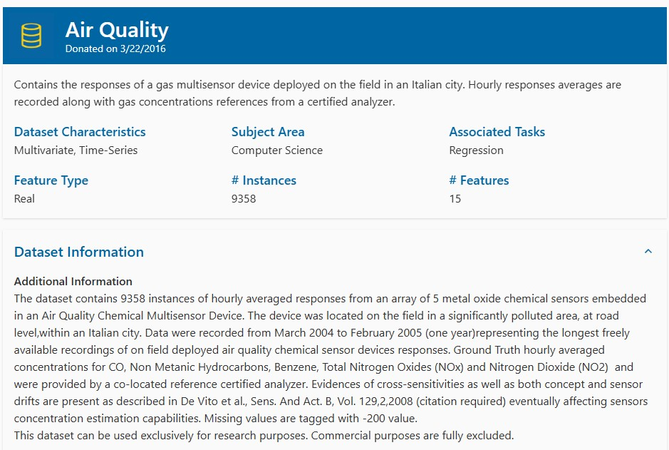
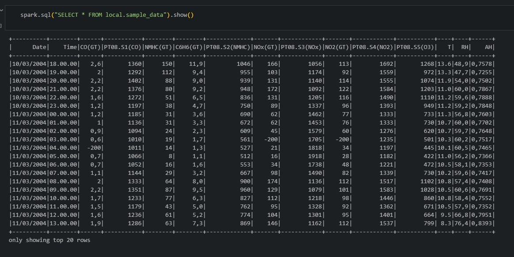
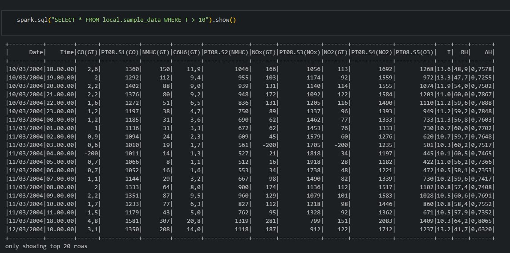
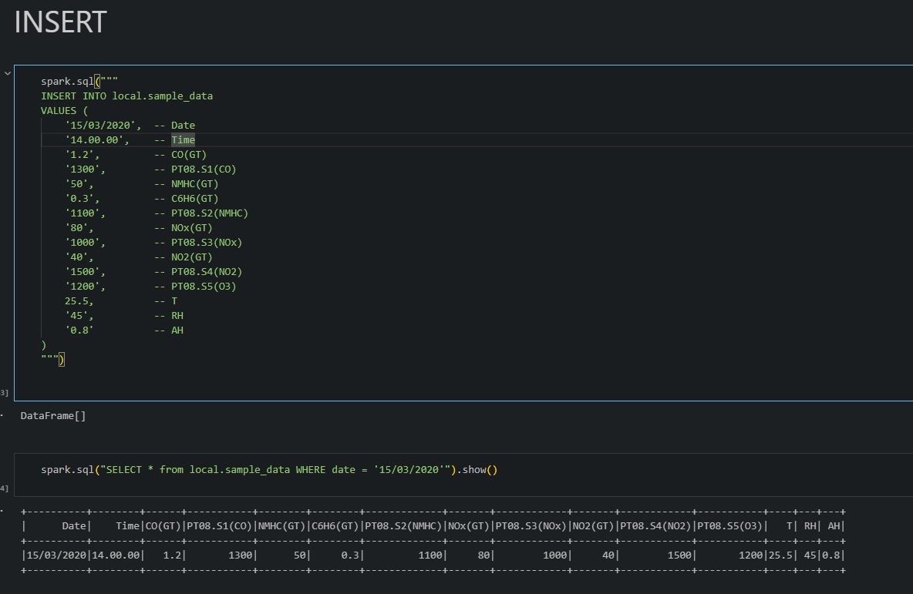
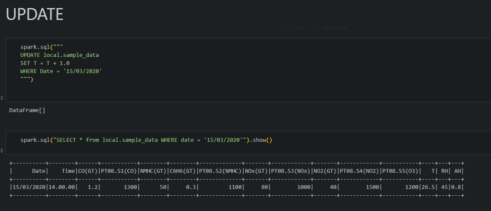
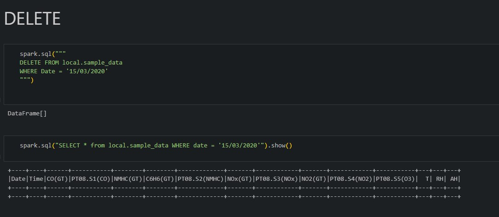

# Armazenamento e análise de dados um CSV utilizando PySpark + Apache Iceberg

O CSV utilizado foi o: https://archive.ics.uci.edu/dataset/360/air+quality da UCI Machine Learning Repository, que contém dados sobre a qualiade do ar de uma cidade italiana medidas por um sensor de gás categorizada por data e hora.



## Preparando ambiente

Iniciamos a sessão spark, definimos um DataFrame com os dados do CSV e então tratamos os dados, dando atenção principalmente para o "casting" para int, double ou float das colunas para realizar operações/comparações numéricas.

```python
df = spark.read \
    .option("header", True) \
    .option("inferSchema", False) \
    .option("delimiter", ";") \
    .csv("data/sample.csv")

df = df.drop("_c15", "_c16")
df.printSchema()

from pyspark.sql.functions import regexp_replace, col

df = df.withColumn("T", regexp_replace(col("T"), r"[^0-9.]", "").cast("double"))
df = df.withColumn("T", col("T") / 10)

df.show(5)
df.printSchema()
df.select("T").show(20)
```

Criamos então a tabela Iceberg com:

```python
df.write.format("iceberg").mode("overwrite").saveAsTable("local.sample_data")
```

## Podemos agora, com o auxílio do Iceberg, utilizar comandos SQL para analisar e manipular os dados:



Aqui, podemos realizar uma query selecionando apenas os registros onde a temperatura esteve acima dos 10 graus Celsius, representada pela coluna "T" no nosso dataframe.



Exemplos de outros comandos SQL evidenciando as funcionalidades:






